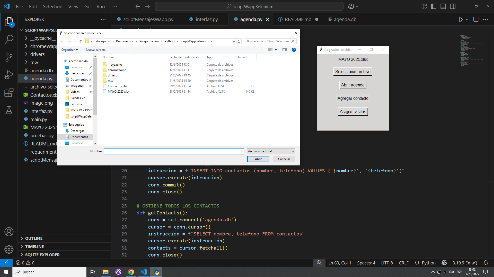

# Asignador de Visitas y Envío Automático de Mensajes por WhatsApp  
# WhatsApp Visit Scheduler and Automated Message Sender

Este programa permite importar un archivo de Excel, leer y filtrar las columnas validadas en el código, formatear los datos y enviar mensajes por **WhatsApp Web** de manera automática a los contactos cargados en la agenda integrada.

This tool imports an Excel file, filters and formats the relevant data, and automatically sends messages via **WhatsApp Web** to contacts stored in an integrated agenda system.

> Proyecto real en desarrollo, creado como parte de mi transición profesional hacia software y automatización.  
> Diseñado para una empresa local que necesita un sistema de recordatorios automáticos para visitas a obras agendadas.

> Real-world project in progress, built as part of my professional transition toward software development and automation.  
> Developed for a local company that needs automated reminders for scheduled site visits.

---

## Tecnologías utilizadas  
## Technologies Used

- **Python 3**
- [Tkinter](https://docs.python.org/3/library/tkinter.html) – interfaz gráfica / GUI
- [Selenium](https://www.selenium.dev/) – automatización web / web automation
- [SQLite](https://www.sqlite.org/index.html) – base de datos de contactos / contact database
- [Pandas](https://pandas.pydata.org/) – procesamiento de Excel / Excel file processing
- [webdriver-manager](https://pypi.org/project/webdriver-manager/) – gestión de WebDriver / WebDriver management

---

## Capturas de pantalla / Screenshots

  
  
  
  
  
  
  


---

## Instalación y uso  
## Installation and Usage

### 1. Clonar el repositorio / Clone the repository

```bash
git clone https://github.com/tu-usuario/whatsapp-visitas.git
cd whatsapp-visitas
```

### 2. Instalar dependencias / Install dependencies

Recomiendo usar un entorno virtual.  
I recommend using a virtual environment:

```bash
python -m venv venv
source venv/bin/activate  # o venv\Scripts\activate en Windows
pip install -r requirements.txt
```

### 3. Ejecutar la aplicación / Run the application

```bash
python interfaz.py
```

### 4. Requisitos / Requirements

- Tener **Google Chrome** instalado.  
  Have **Google Chrome** installed.

- Tener agendados los números en WhatsApp a los que se enviarán los mensajes.  
  Make sure the contacts are saved in WhatsApp.

- Contar con un archivo Excel con visitas. Se incluye un ejemplo en la carpeta `/ejemplos`.  
  An example Excel file is included in the `/ejemplos` folder.

- La primera vez que se ejecuta, el programa solicitará escanear el código QR de WhatsApp Web.  
  Then it will store the session for future runs.  
  The program will prompt a WhatsApp QR scan the first time it runs, and store the session afterward.

---

## Funcionalidades actuales  
## Current Features

- Crea un nuevo perfil en Google Chrome donde guarda la sesión iniciada.  
  Creates a new Chrome profile to store the WhatsApp session.

- Carga y lectura de archivo Excel con información de visitas.  
  Imports and processes visit data from Excel.

- Agenda visual con posibilidad de agregar, modificar y eliminar contactos.  
  Integrated contact manager (add, edit, delete).

- Envío automatizado de mensajes por WhatsApp a contactos filtrados.  
  Automatically sends messages via WhatsApp Web to selected contacts.

- Interfaz gráfica clara y lista para uso práctico.  
  Clean and practical GUI.

---

## Estado del proyecto  
## Project Status

Este proyecto se encuentra en una **versión beta estable**.  
Es completamente funcional y está en uso real, aunque continúa en desarrollo activo.

This is a **stable beta release**.  
It is fully functional and being used in a real context, but under active development.

---

## Mejoras previstas  
## Planned Improvements

- Validación de formato de teléfono.  
  Phone number validation.

- Búsqueda y filtros en la agenda de contactos.  
  Search and filter capabilities in the agenda.

- Mensajes personalizados por contacto.  
  Personalized messages per contact.

- Multiproceso para acelerar el envío.  
  Multithreading for faster delivery.

- Interfaz adaptable a otros casos de uso.  
  Flexible interface for broader use cases.

---

## Sobre mí  
## About Me

Mi nombre es **Nicolás**, soy docente e ingeniero de sonido.  
Me interesa la tecnología, y estoy en proceso de reconversión profesional hacia la programación, automatización y desarrollo de experiencias sonoras interactivas en videojuegos o entornos AR/VR.

My name is **Nicolás**, I’m a teacher and sound engineer.  
I’m currently shifting my career toward programming, automation, and creative audio implementation in games and interactive media (AR/VR).

---

## Contacto  
## Contact

Podés escribirme por [LinkedIn](https://www.linkedin.com/in/nipadin/) o por correo:  
You can reach me via [LinkedIn](https://www.linkedin.com/in/nipadin/) or email:

**nicolaspadin@live.com.ar**
